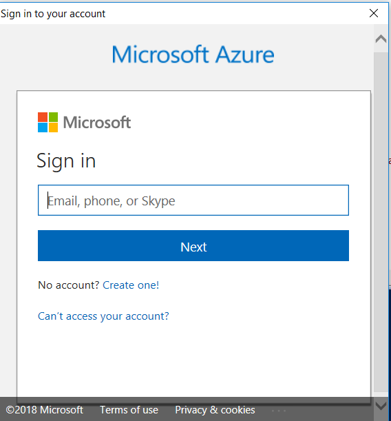

# GAB2018
## ARM part
- Download and install Azure PowerShell [here](https://github.com/Azure/azure-powershell/releases/tag/v5.7.0-April2018)
- Create connection to Azure subscription via service principal:
  - Open script [Create-Connection.ps1](./Create-Connection.ps1) in PowerShell ISE and specify required params
  - Run it. During execution yor will be promted to login in Azure subscription via interactive window 
  - In script output yor will receive details for created connection
``` powershell
***************************************************************************
Connection Name: <connection name>
Subscription Id: <subscription Id>
Subscription Name: <subscription name>
Service Principal Id: <service principal Id>
Service Principal key: <service principal key>
Tenant Id: <tenant Id>
***************************************************************************
``` 
- Open script [Deploy.ps1](./ARM/Deploy.ps1) in PowerShell ISE and specify required properties in param block:
``` powershell
param(
 [string]$ServicePrincipalId = "<put your service principal id here>",

 [string]$ServicePrincipalKey = "<put your service principal key here>",

 [string]$TenatID = "<put your tenant id here>",

 [string]$resourceGroupName = "GAB-ARM",

 [string]$resourceGroupLocation = "EastUS",

 [string]$deploymentName = "GAB-ARM",

 [string]$templateFilePath = "C:\GAB2018\ARM\LinuxVM.json",

 [string]$parametersFilePath = "C:\GAB2018\ARM\params.json"
)
```
- Specify missing parameters in [params.json](./ARM/params.json).
``` json
"adminPassword": {
            "metadata": {
                "description": "Administrator password."
                },
            "value": "<put VM admin password here>"
        },
```
- Run deploy process and validate results.
- Example output:
``` DOS
Outputs                 : {[publicIP, Microsoft.Azure.Commands.ResourceManager.Cmdlets.SdkModels.DeploymentVariable]}
OutputsString           : 
                          Name             Type                       Value     
                          ===============  =========================  ==========
                          publicIP         String                     52.234.***.***
```


## Terraform part
- Download and install terraform [here](https://www.terraform.io/intro/getting-started/install.html)
- Open [LinuxVM.tf](./TF/LinuxVM.tf) and specify connection details.
``` yaml
provider "azurerm" {
  subscription_id = "<put your subscription id here>"
  client_id       = "<put your service principal id here>"
  client_secret   = "<put your service principal key here>"
  tenant_id       = "<put your tenant id here>"
}
```
- Put missiong parameters in [variables.tf](./TF/variables.tf) if any
``` yaml
variable "adminPassword" {
  description = "Administrator password"
  default     = "<put VM admin password here>"
}
```
- Open cmd and go to directory where terraform files are located:
``` DOS	
C:\Users\> cd c:\GAB2018\TF
```
- Initialize a working directory containing Terraform configuration files:
``` DOS	
c:\GAB2018\TF> terraform init
```
- Prepare deployment plan
``` DOS	
c:\GAB2018\TF> terraform plan -out=GAB -input=false
```
- Run deployment from prepared plan
``` DOS	
c:\GAB2018\TF> terraform apply "GAB"
```
- Example output:
``` DOS
Apply complete! Resources: 7 added, 0 changed, 0 destroyed.

Outputs:

PublicIP = 52.170.***.***
```
